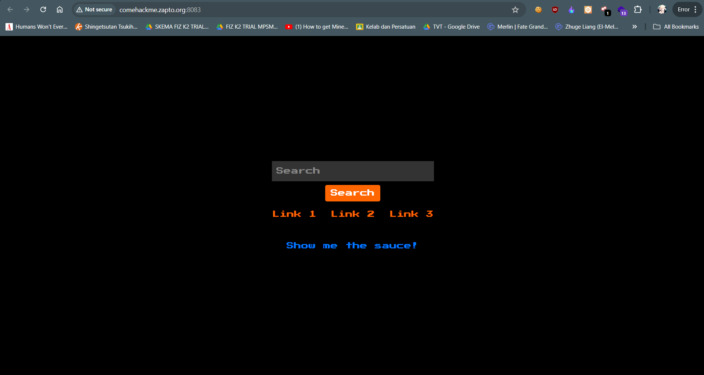
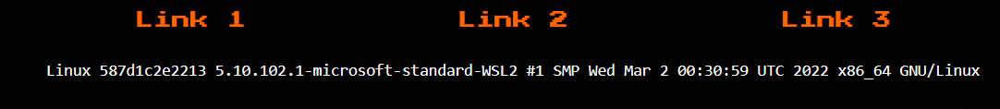
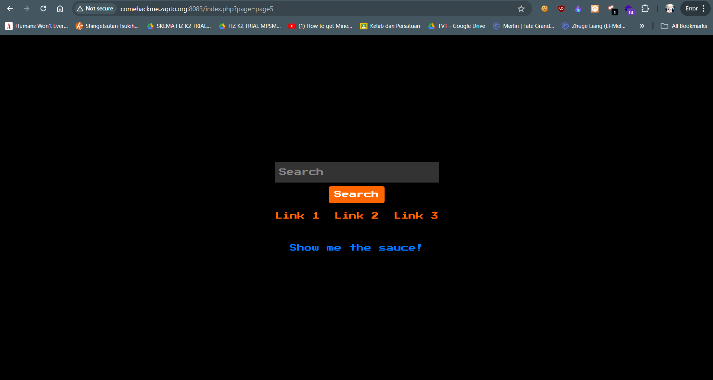
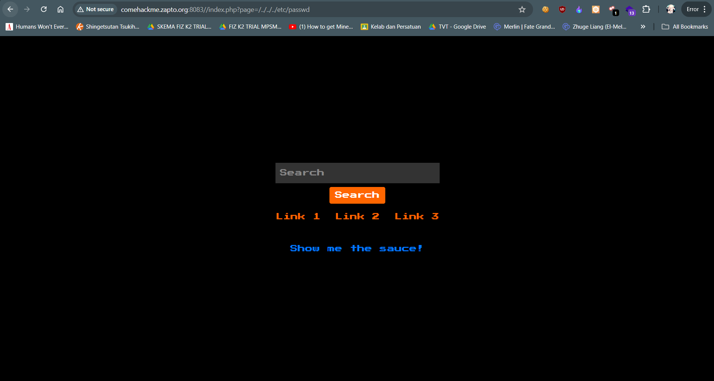
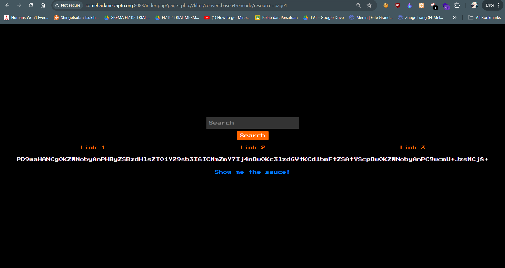
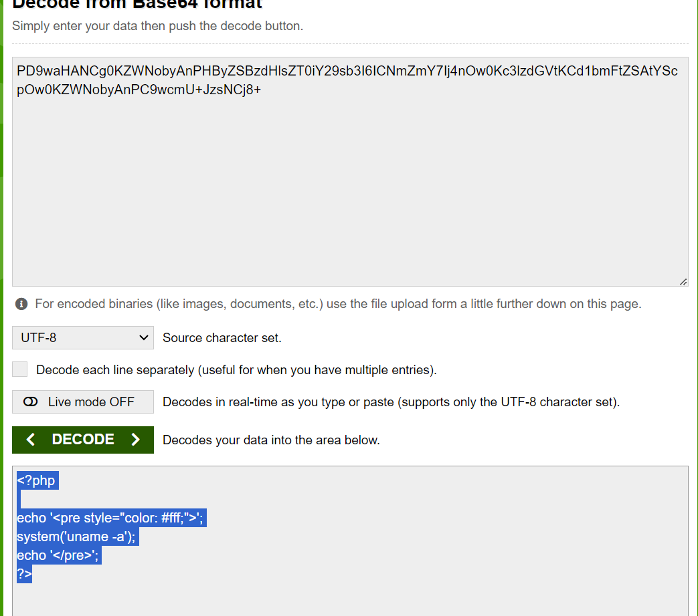
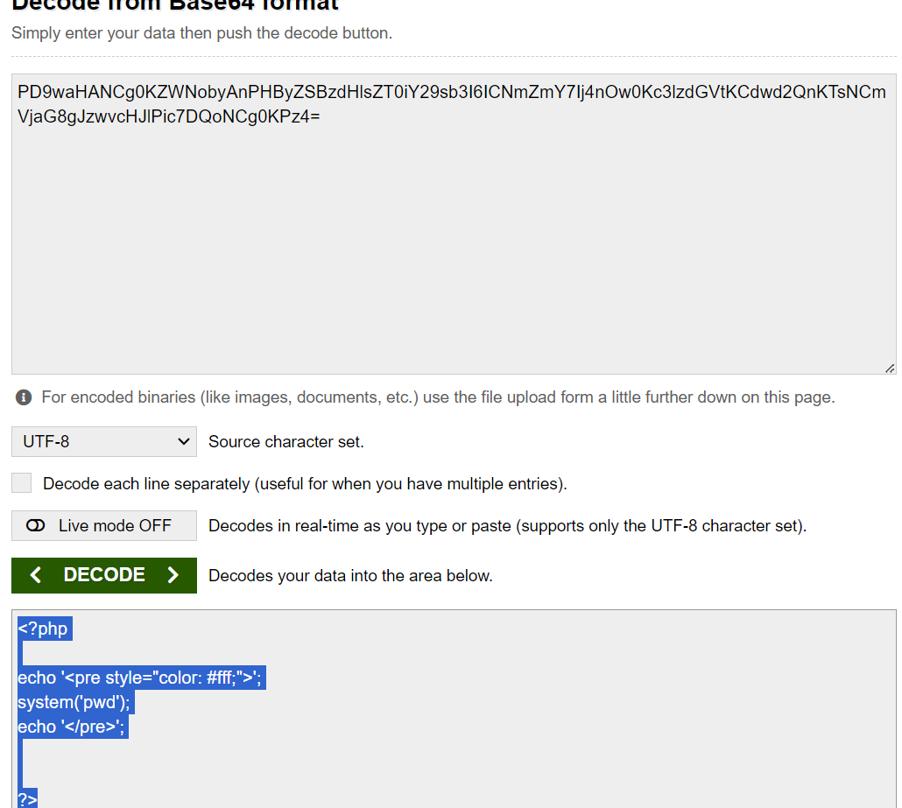
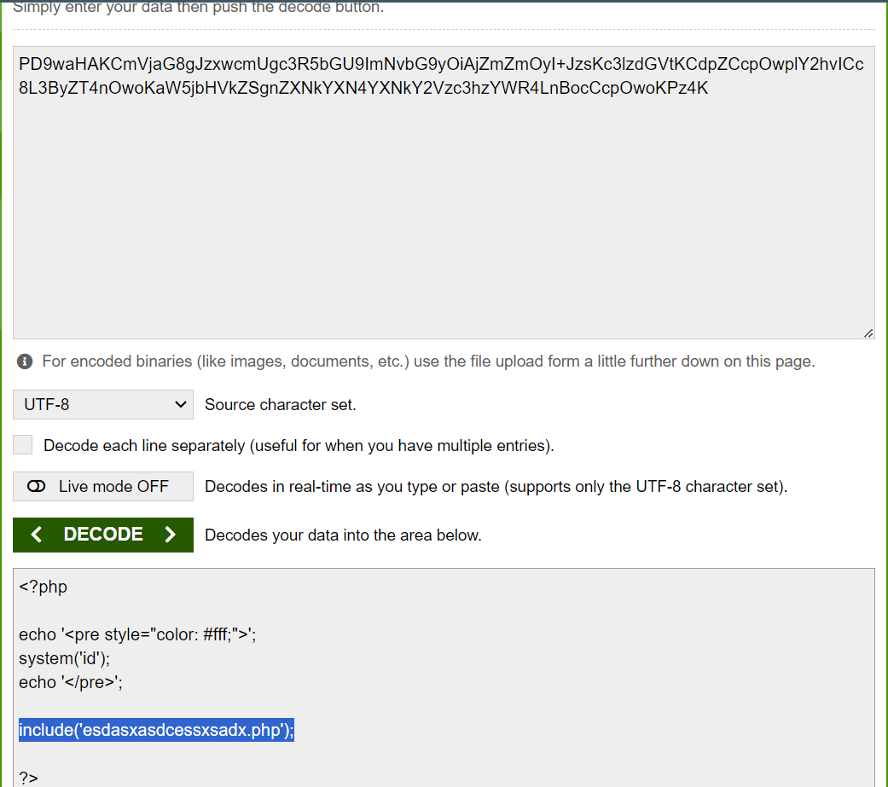
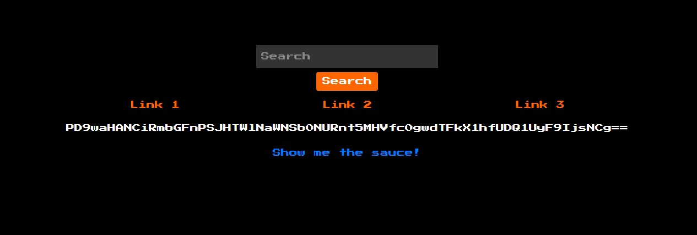
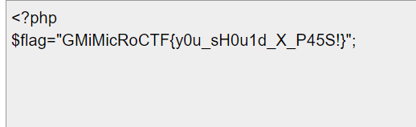

# Loot From Inside

## Solution

When redirected to the website, we can see a bunch of things like a search bar, and some link buttons. The website itself does nothing really, even the links provided are just Linux commands that doesn't bring much use





Checking the sauce

```php
<?php
error_reporting(0);

if (isset($_GET['debug'])) {
    die(highlight_file(__FILE__));
}
?>
<!DOCTYPE html>
<html>
<head>
    <title>Simple Search Website</title>
    <!-- Add Bootstrap CSS -->
    <link rel="stylesheet" href="https://maxcdn.bootstrapcdn.com/bootstrap/4.5.2/css/bootstrap.min.css">
    <style>
        body {
            display: flex;
            justify-content: center;
            align-items: center;
            height: 100vh;
            margin: 0;
            background-color: #000;
            color: #fff;
            font-family: 'Press Start 2P', cursive;
        }
        .search-container {
            text-align: center;
        }
        .search-input {
            padding: 10px;
            font-size: 16px;
            background-color: #333;
            color: #fff;
            border: none;
        }
        .search-input::placeholder {
            color: #888;
        }
        .btn-primary {
            background-color: #ff6600;
            border: none;
        }
        .links {
            margin-top: 20px;
        }
        .links a {
            display: block;
            margin-bottom: 5px;
            color: #ff6600;
        }
    </style>
    <!-- Add Google Fonts for retro video game style font -->
    <link href="https://fonts.googleapis.com/css2?family=Press+Start+2P&display=swap" rel="stylesheet">
</head>
<body>
    <div class="search-container">
        <?php
            if(isset($_POST['submit']))
            {

                $result = htmlentities($_POST['search']);
                echo "<p>Result : ".$result."</p>";
            }
        ?>
        <form method="post" action="">
            <input type="text" name="search" class="search-input" placeholder="Search" required autocomplete="off">
            <br>
            <button type="submit" name="submit" value="submit" class="btn btn-primary mt-2">Search</button>
        </form>
        <div class="links mt-3">
            <div class="row">
                <div class="col"><a href="index.php?page=page1">Link 1</a></div>
                <div class="col"><a href="index.php?page=page2">Link 2</a></div>
                <div class="col"><a href="index.php?page=page3">Link 3</a></div>
            </div>
        </div>
        <div class="links mt-3">
            <?php
                if(isset($_GET['page']))
                {
                    if(strlen($_GET['page']) > 150){
                        echo "<pre style='color:white;'>Parameter has a maximum character limit of 150</pre>";
                        exit();
                    }

                    include($_GET['page'].".php");
                }
            ?>
        </div>
        <br>
        <center><a href="?debug" target="_blank">Show me the sauce!</a></center>
    </div>
    <!-- Add Bootstrap JS and jQuery -->
    <script src="https://code.jquery.com/jquery-3.6.0.min.js"></script>
    <script src="https://maxcdn.bootstrapcdn.com/bootstrap/4.5.2/js/bootstrap.min.js"></script>
</body>
</html>
<!--firdaus khairuddin-->
1
```

Nothing seems to stand out except for this line of code:

```php
 include($_GET['page'].".php");
```

- `include` is a common PHP function that often contribute to vulnerable web applications. The way it works is by doing a `GET` request via the URL parameter `page` to include the file of the page

At this point I was a bit blunt on how to solve the challenge even having discovered the flaw in the system given when changing pages in the URL doesn't even show me any syntax errors. For example,

```php
index.php?page=page5
```



*Changing the parameter to a non-existent page (page5)*

So I decided to just bruteforce my way in with a bunch of common attempts

### 1st Attempt - Path Traversal

- Trying out "dot-dot-slash attack" which is just directory traversal beyond root and reading /etc/passwd file

```php
/index.php?page=/../../../etc/passwd
```

output:



Again static as ever xD

### 2nd Attempt - PHP wrapper

- PHP:// is a wrapper for Accessing various I/O streams. We will use php://filter — it is a kind of meta-wrapper designed to permit the application of filters to a stream at the time of opening also it is enabled by default . There are multiple parameters to this wrapper, one of the most common one is `convert.base64-encode/resource=`. By piecing it all together the payload will look like this

```
index.php?page=php://filter/convert.base64-encode/resource=
```

Let's test it out on page 1:



Looks like we finally have some response. This definitely looks like base64(i think) so lets try and see what's up.



It seems like this is the php source code of page 1 

Lets try out the other pages

Page 2:



and we get something interesting after decoding page 3



Out of curiosity, I just tried plugging esdasxasdcessxsadx.php within the payload andddddd....



Just throw it into the same decoder and voila...



Flag: `GMiMicRoCTF{y0u_sH0u1d_X_P45S!}`


